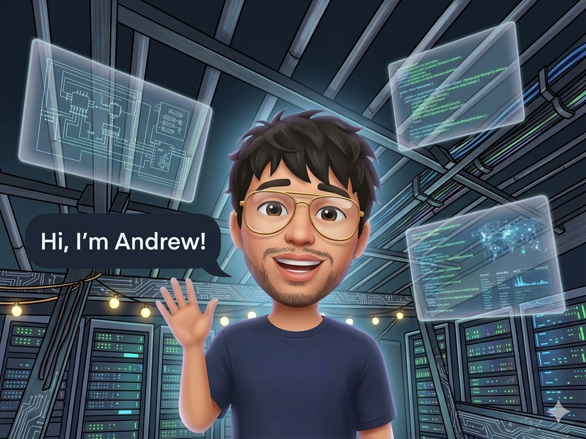

# Hi there!, I'm Andrew B. Erestain 🙋‍♂️

I'm Andrew, a curious and driven **BSIT Student** at **Bicol University** who loves exploring how technology connects creativity and logic. I enjoy learning new things, building meaningful projects, and finding smart ways to solve problems. Whether it’s coding, designing, or experimenting with new ideas, I’m always excited to grow and share what I learn along the way.

---

## 🚀 About Me
- 🎓 Currently pursuing **Bachelor of Science in Information Technology** at **Bicol University**  
- 💻 Skilled in **C programming, HTML/CSS, and robotics**  
- 🌱 Exploring different programming languages and tools to broaden my skills and discover new ways to build and create
- 🎯 Interested in exploring **robotics and automation**, combining coding with hardware to create innovative solutions 

---

## 🛠️ Tech Stack
- **Languages:** C, HTML, CSS  
- **Tools:** VS Code, Dev-C++, Logisim, Tinkercad  

---

## 📈 Goals
- Build more projects that showcase creativity and technical skills  
- Explore new programming languages and gain new knowledge  
- Develop and polish my portfolio to reflect growth and accomplishments  

---

## 📫 Contact
- 📧 Email: erestainandrew9@gmail.com 
- 🐙 GitHub: [github.com/Ryujikun9](https://github.com/Ryujikun9)

---

## ✨ Fun Fact
I enjoy exploring robotics projects, where I get to combine coding with hardware and see ideas come to life.
